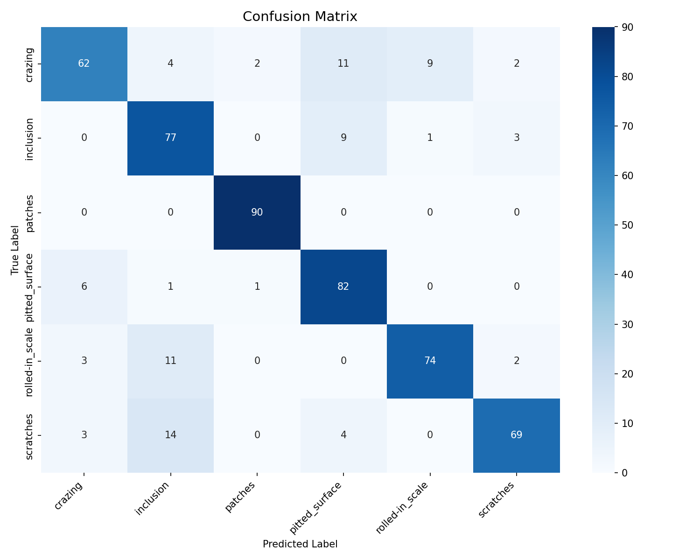
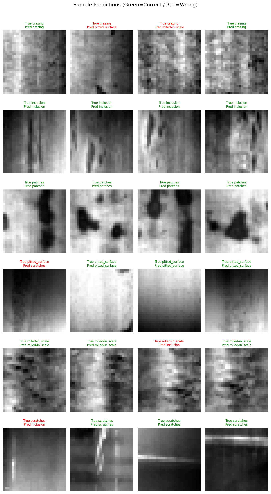
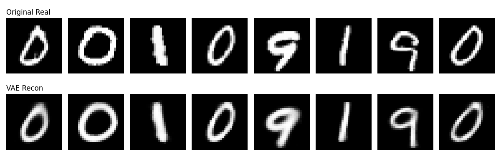
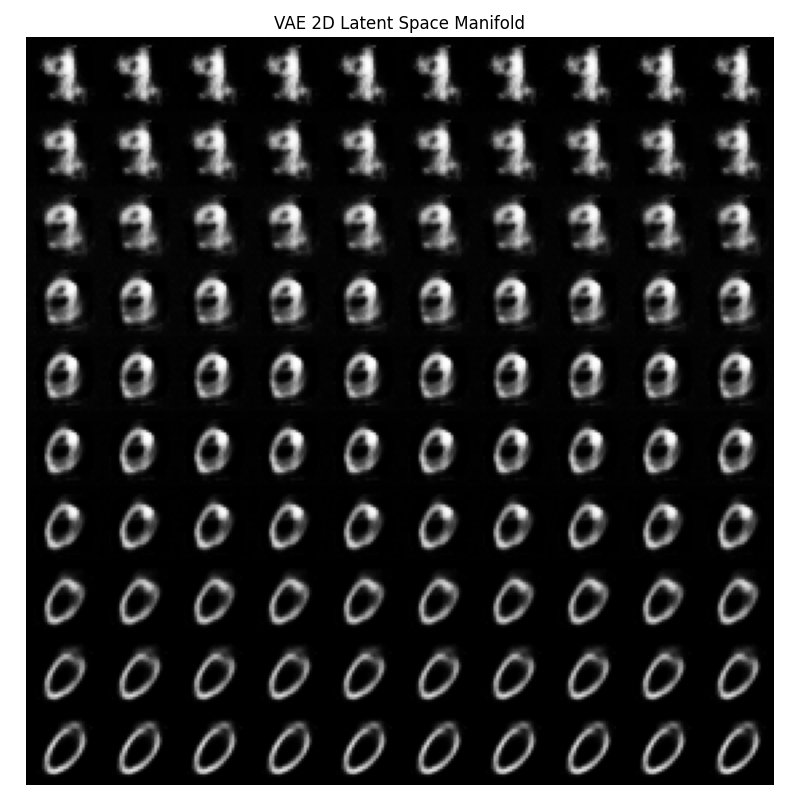
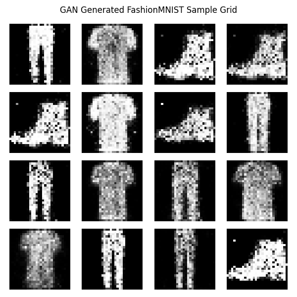
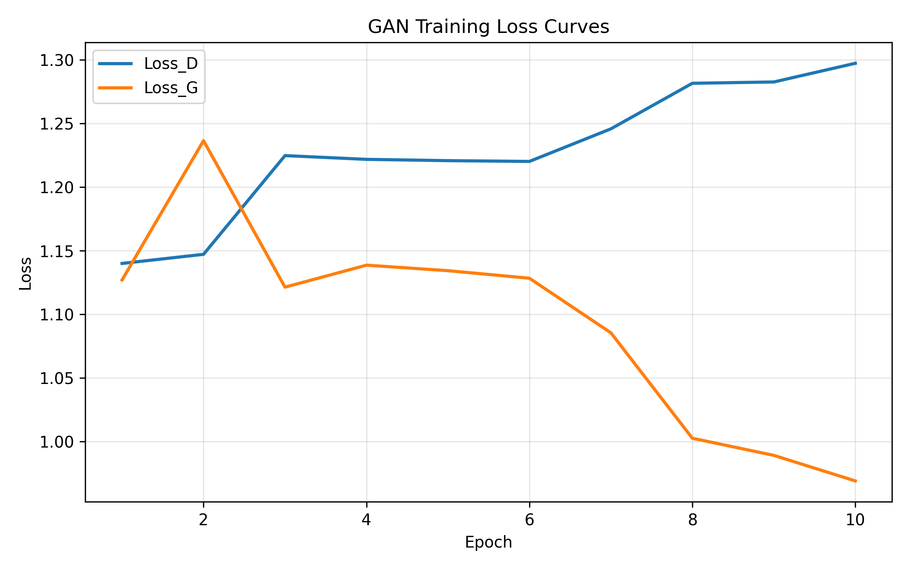
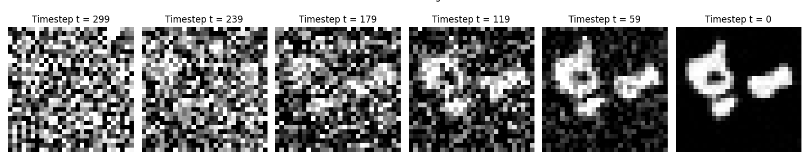
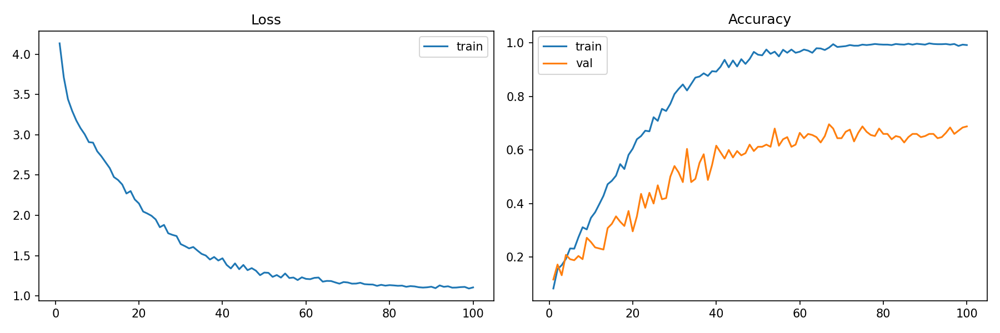

# NYCU Machine Learning: Homework and Final Project

>國立陽明交通大學 114學年度下學期  
電控工程研究所 機器學習 林顯易教授  

Coursework for the Machine Learning course at National Yang Ming Chiao Tung University (Spring 2026, Prof. Hsien-I Lin). The course follows *Deep Learning: Foundations and Concepts* (Bishop & Bishop, 2024), and equation and algorithm numbers in the code refer to that book.

The repository contains four homework assignments and an individual final project. Each folder includes the original assignment handout as a PDF.

## Overview

| Assignment | Topic | Main constraint | Code |
|---|---|---|---|
| [HW1](HW1/) | Linear / ridge regression, logistic regression | NumPy only | [regression.ipynb](HW1/Regression/regression.ipynb), [classification.ipynb](HW1/Classification/classification.ipynb) |
| [HW2](HW2/) | DNN forward pass, SGD / Momentum / Adam, autodiff | NumPy only | [dnn.ipynb](HW2/1.%20DNN/dnn.ipynb), [gd.ipynb](HW2/2.%20GD/gd.ipynb), [backpropagation.ipynb](HW2/3.%20Backpropagation/backpropagation.ipynb) |
| [HW3](HW3/) | Vision Transformer for steel defect classification | PyTorch, no prebuilt ViT modules | [vit.py](HW3/vit.py) |
| [HW4](HW4/) | VAE, GAN, DDPM | PyTorch | [1_vae_code.py](HW4/1_vae_code.py), [2_gan_code.py](HW4/2_gan_code.py), [3_ddpm_code.py](HW4/3_ddpm_code.py) |
| [Final Project](Final_Project/) | Multimodal Taiwanese food classification | No pretrained weights, no external data | [Transformer_TTA.py](Final_Project/Transformer_TTA.py) |

## Repository structure

```
.
├── HW1/
│   ├── Homework 1_ML.pdf
│   ├── Regression/          regression.ipynb, regression_data.npy
│   └── Classification/      classification.ipynb, classification.csv
├── HW2/
│   ├── Homework 2.pdf
│   ├── 1. DNN/              dnn.ipynb + MNIST idx files
│   ├── 2. GD/               gd.ipynb + MNIST idx files
│   └── 3. Backpropagation/  backpropagation.ipynb + MNIST idx files
├── HW3/
│   ├── Homework 3.pdf
│   ├── vit.py               ViT implementation, training, evaluation, plots
│   ├── vit.pth              trained weights
│   ├── dataset.zip          raw defect images
│   └── confusion_matrix.png, sample_predictions.png
├── HW4/
│   ├── Homework 4.pdf
│   ├── 1_vae_code.py, 2_gan_code.py, 3_ddpm_code.py
│   ├── hw4_template.py      original course template
│   └── output_plots/
└── Final_Project/
    ├── Multimodal Final Project 2026_upload.pdf
    ├── Transformer_TTA.py   model, training, inference
    ├── my_model_scratch.pth trained weights
    ├── submission.csv       predictions on the test set
    ├── *.csv                class labels, ingredient descriptions, test hints
    ├── Data_Labeler/        offline reference-labelling scripts
    └── evaluate/            local accuracy check
```

## HW1: Regression and Classification

Handout: [Homework 1_ML.pdf](HW1/Homework%201_ML.pdf). Everything is written with NumPy; scikit-learn models are not allowed.

### Regression

[regression.ipynb](HW1/Regression/regression.ipynb) fits a one-feature linear model `y = mx + b` in four ways:

- Linear regression trained by gradient descent on the MSE loss.
- Ridge regression trained by gradient descent with an L2 penalty (λ = 0.1).
- Closed-form ridge regression, `w = (XᵀX + λI)⁻¹Xᵀy`.
- The predictive distribution, plotted with a confidence band around the mean.

It also compares training loss curves across learning rates and iteration counts.

| Model | Weight (m) | Bias (b) | MSE |
|---|---|---|---|
| Linear regression (GD) | 52.74 | -0.33 | 110.44 |
| Ridge regression (GD) | 47.63 | -0.39 | 122.25 |
| Ridge regression (closed form) | 52.74 | -0.33 | 110.42 |

### Classification

[classification.ipynb](HW1/Classification/classification.ipynb) predicts whether a person earns more than $50K a year from binned demographic and work features (48,842 rows, one-hot encoded and standardized, with the train/test split given by the dataset's `flag` column). Logistic regression is implemented from scratch, along with the confusion matrix, ROC curve and AUC. A probit regression model is included as an extra comparison.

Logistic regression on the test set, for the three settings the handout requires:

| Learning rate | Iterations | Accuracy | F-score | AUC |
|---|---|---|---|---|
| 0.001 | 2000 | 0.7364 | 0.4794 | 0.7462 |
| 0.00001 | 6000 | 0.7065 | 0.3619 | 0.6052 |
| 0.0001 | 1500 | 0.7106 | 0.3859 | 0.6531 |

## HW2: DNN, Gradient Descent, Backpropagation

Handout: [Homework 2.pdf](HW2/Homework%202.pdf). All three parts use MNIST and NumPy only.

### 1. Deep neural network (forward pass)

[dnn.ipynb](HW2/1.%20DNN/dnn.ipynb) builds a feedforward network with two hidden layers: activation functions (ReLU, tanh, softplus, leaky ReLU), softmax output and cross-entropy loss, plus a per-class confusion matrix, ROC curves, precision, recall and F1.

The assignment asks for the forward pass only, with no backpropagation. The "training" loop therefore draws random weights repeatedly and keeps the set with the lowest training loss, so accuracy stays close to chance. It is evaluated on a 2,000-image training subset and a 200-image test subset.

| Configuration | Test accuracy |
|---|---|
| Baseline: 64-16 hidden units, ReLU, 1 draw | 0.130 |
| Wider layers: 256-128 | 0.100 |
| tanh + leaky ReLU | 0.170 |
| 1000 draws | 0.155 |
| Final: 128-64, tanh + leaky ReLU, 1000 draws | 0.185 |

### 2. Gradient descent optimizers

[gd.ipynb](HW2/2.%20GD/gd.ipynb) trains a binary logistic classifier ("is this digit *d* or not") with three optimizers written from scratch: mini-batch SGD (Algorithm 7.2), SGD with momentum (Algorithm 7.3) and Adam (Algorithm 7.4). It runs all ten target digits and shows misclassified samples for each optimizer.

Test accuracy for a few of the target digits:

| Target digit | Mini-batch SGD | Momentum | Adam |
|---|---|---|---|
| 0 | 0.9895 | 0.9915 | 0.9927 |
| 1 | 0.9896 | 0.9929 | 0.9940 |
| 8 | 0.9451 | 0.9600 | 0.9541 |
| 9 | 0.9568 | 0.9640 | 0.9629 |

The notebook also sweeps the learning rate (0.1 to 0.0001), batch size (16 to 1024) and momentum coefficient (0 to 0.99) on digit 0. Plain SGD degrades the most at small learning rates (0.9020 at 0.0001, against 0.9870 for Adam), while batch size has almost no effect on the final accuracy.

### 3. Backpropagation and autodiff

[backpropagation.ipynb](HW2/3.%20Backpropagation/backpropagation.ipynb) trains a logistic classifier for "is it a 9 or not" with SGD and traces a small computation graph (`w1·x1 + w2·x2`) three ways: primal values, forward-mode tangents and reverse-mode adjoints. Test accuracy is 0.9361.

## HW3: Vision Transformer from scratch

Handout: [Homework 3.pdf](HW3/Homework%203.pdf).

[vit.py](HW3/vit.py) implements a Vision Transformer in PyTorch without any prebuilt Transformer or ViT modules: patch embedding, a learnable [CLS] token and positional embedding, pre-norm encoder blocks with multi-head self-attention and an MLP, and a classification head on the [CLS] output.

The task is classifying six kinds of steel surface defects: crazing, inclusion, patches, pitted surface, rolled-in scale and scratches. The script unzips the dataset, splits it 70/30 into train and test sets, and resizes images to 28×28 grayscale.

| Setting | Value |
|---|---|
| Patch size | 2×2 (196 patches) |
| Embedding dim / depth / heads | 128 / 8 / 8 |
| MLP dim | 256 |
| Dropout | 0.1 |
| Optimizer | Adam, lr 3e-4, weight decay 1e-4, cosine annealing |
| Epochs / batch size | 30 / 32 |
| Parameters | about 2.66M |

Test accuracy is **83.15%** (449 of 540 images), above the 80% the assignment requires. The largest group of errors is rolled-in scale and scratches being predicted as inclusion.





## HW4: Generative models

Handout: [Homework 4.pdf](HW4/Homework%204.pdf). All three models are trained for 10 epochs on a three-class subset (classes 9, 0 and 1) of their dataset.

### VAE on MNIST

[1_vae_code.py](HW4/1_vae_code.py): an MLP encoder outputs μ and log σ² for a 20-dimensional latent, the reparameterization trick samples `z = μ + ε·σ`, and the loss is the negative ELBO (summed MSE reconstruction plus the analytical KL divergence).





### GAN on FashionMNIST

[2_gan_code.py](HW4/2_gan_code.py): an MLP generator maps 100-dimensional noise to a 28×28 image, and an MLP discriminator classifies real against fake. The two are updated alternately with BCE loss, using the non-saturating generator loss.





### DDPM on MNIST

[3_ddpm_code.py](HW4/3_ddpm_code.py): a linear noise schedule over T = 300 steps, closed-form forward diffusion `q(x_t | x_0)`, and a small time-conditioned UNet trained to predict the added noise. Sampling runs the full reverse process from Gaussian noise.



## Final Project: Multimodal Taiwanese Food Classification

Handout: [Multimodal Final Project 2026_upload.pdf](Final_Project/Multimodal%20Final%20Project%202026_upload.pdf).

### Task

Classify a dish into one of 25 Taiwanese food classes from two inputs: a photo and a text hint listing ingredients. It was run as an individual Kaggle competition scored on accuracy.

- Training set: 1,500 labelled images (60 per class). Each class has a full ingredient list.
- Test set: 4,832 unlabelled images, each with only 2 or 3 randomly chosen ingredients as the hint. The hint alone is often ambiguous.
- No pretrained models and no external data. Both encoders must be trained from scratch.
- The 50/50 rule: at inference, `final_score = 0.5 × softmax(image_logits) + 0.5 × softmax(text_logits)`.

### Approach

Everything is in [Transformer_TTA.py](Final_Project/Transformer_TTA.py), which trains the model, saves the best weights and writes `submission.csv` in one run.

- **Image encoder.** A ResNet-style CNN: a 7×7 stem followed by four residual stages (32, 64, 128, 256 channels) and global average pooling, giving a 256-dimensional feature.
- **Text encoder.** A 2-layer pre-norm Transformer encoder over ingredient word tokens (128-dimensional embeddings, 4 heads), with a learnable [CLS] token whose output is the text feature.
- **Heads.** Each modality has its own linear classifier, so the model returns image logits and text logits separately.
- **Hint simulation.** Training images are paired with their class's full ingredient list, but test images only get a partial hint. To close that gap, each training sample keeps just 1 to 3 randomly chosen tokens from its ingredient list.
- **Training.** Loss is `CE(image) + 0.3 × CE(text)` with label smoothing 0.1, optimized with AdamW and cosine annealing for 100 epochs. Image augmentation uses random resized crops, flips, rotation, translation and color jitter. The last 10 images of each class are held out for validation.
- **Inference.** Eight deterministic test-time augmentation views (center crop, four corner crops, a flipped center crop, and a larger-scale crop with its flip). The 50/50 fused score is computed for each view and summed before taking the argmax.

The curve below shows the training loss and the accuracy of the image branch alone on the train and validation splits.



### Offline evaluation tooling

The test labels are hidden, so these scripts were used to estimate accuracy locally between Kaggle submissions:

- [Data_Labeler/](Final_Project/Data_Labeler/) builds a reference labelling of the test set. Test images whose ingredient hint matches exactly one class are labelled directly. For the rest, a local Qwen2.5-VL model (through Ollama) picks from the candidate classes that the hint allows, or returns `None`.
- [evaluate/self_gt.csv](Final_Project/evaluate/self_gt.csv) is the resulting reference labelling, and [evaluate/eval.py](Final_Project/evaluate/eval.py) compares a submission file against it.

These reference labels were used only for evaluation. The classifier is trained solely on the 1,500 provided training images and uses no pretrained weights.

## Setup

Python 3 with:

```
pip install numpy pandas scipy matplotlib seaborn torch torchvision einops scikit-learn torchsummary tqdm pillow
```

`ollama` is needed only for the labelling script in `Final_Project/Data_Labeler/`.

The scripts use relative paths, so run each one from its own folder.

| Assignment | How to run | Data |
|---|---|---|
| HW1, HW2 | Open the notebook in Jupyter and run all cells | Included in the repo |
| HW3 | `cd HW3 && python vit.py` | `dataset.zip` is included and is unpacked and split on first run |
| HW4 | `cd HW4 && python 1_vae_code.py` (likewise for the other two) | MNIST and FashionMNIST download automatically into `HW4/data/` |
| Final Project | `cd Final_Project && python Transformer_TTA.py` | `train/` and `test/` are not in the repo; get them from the course Kaggle competition |
| Final Project, local check | `cd Final_Project/evaluate && python eval.py --pred ../submission.csv` | Uses `self_gt.csv` |

## Acknowledgements

Starter templates were provided by the course teaching assistants:

- Homework 1 and 2: [Satriosnjya/ML-Labs](https://github.com/Satriosnjya/ML-Labs)
- Homework 3 and 4: [ahsanfs/ML-Labs](https://github.com/ahsanfs/ML-Labs.git)

This repository is a personal archive of coursework.
